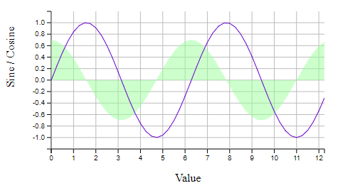
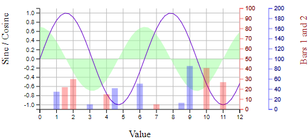
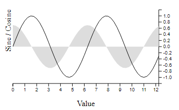

# d3fc-flexi-chart

A more flexible alternative to d3fc's Cartesian chart component that renders to canvas or SVG.



[Main d3fc package](https://github.com/d3fc/d3fc)

## Installing

```bash
npm install d3fc-flexi-chart
```

## API Reference

### General API

d3fc provides a component for building a simple Cartesian chart.

[d3fc-chart documentation](https://d3fc.io/api/chart-api.html)

`d3fc-flex-chart` takes a similar approach, but builds a chart by composing one or more "layers".

From the d3fc `chartCartesian`, this:

```javascript
const cartesian = fc.chartCartesian(d3.scaleLinear(),d3.scaleLinear())
  .yLabel('Sine / Cosine')
  .xLabel('Value')
  .yOrient('left')
  .yDomain(yExtent(data))
  .xDomain(xExtent(data))
  .svgPlotArea(multiSvg);
```

becomes this:

```javascript
const chart = fcFlexi.chart()
  .leftLabel('Sine / Cosine')
  .bottomLabel('Value')
  .layers(
    fcFlexi.svgLayer(d3.scaleLinear(), d3.scaleLinear())
      .yOrient('left')
      .yDomain(yExtent(data))
      .xDomain(xExtent(data))
      .plotArea(multiSvg)
  );
```

Most of the properties of the original `chartCartesian` are now properties of the "layer" component. The chart itself provides properties for `leftLabel`, `topLabel`, `rightLabel` and `bottomLabel`.

Each layer has its own xScale and yScale, and its own series. This allows you to compose more complex charts with multiple layers, different scales, and multiple x/y axes, while keeping the API simple and familiar.



Given the following div:

```html
<div id="sine" style="width: 500px; height: 250px"></div>
```

The following code renders a Cartesian chart:

```javascript
var data = d3.range(50).map((d) => ({
    x: d / 4,
    y: Math.sin(d / 4),
    z: Math.cos(d / 4) * 0.7
}));

// use d3fc-extent to compute the domain for each axis
var xExtent = fc.extentLinear()
  .accessors([d => d.x]);
var yExtent = fc.extentLinear()
  .accessors([d => d.y, d => d.z])
  .pad([0.1, 0.1])

// series (from d3fc-series)
// n.b. the series are rendered using canvas
var line = fc.seriesCanvasLine();
var area = fc.seriesCanvasArea()
  .mainValue(d => d.z);

// combine into a single series
var multi = fc.seriesCanvasMulti()
  .series([area, line]);

// the d3fc-flexi-chart component, which uses d3fc-element for layout
// of the standard features of a chart (axes, labels, plot area)
var chart = fcFlexi.chart()
  .leftLabel('Sine / Cosine')
  .bottomLabel('Value')
  .layers(
    fcFlexi.canvasLayer(d3.scaleLinear(), d3.scaleLinear())
      .yDomain(yExtent(data))
      .xDomain(xExtent(data))
      .plotArea(multi)
  );

// render
d3.select('#sine')
  .datum(data)
  .call(chart);
```

Rendering the following:



The chart is constructed using a single layer that has a pair of scales. The scale configuration properties are rebound (i.e. re-exposed) via the layer component with `x` and `y` prefixes. The chart takes care of layout, and will also re-render if the size of the containing element changes.

### Styles

The component automatically injects a stylesheet to apply the necessary CSS to the elements. These styles can be augmented with CSS -

```css
d3fc-group.flexi-chart > .bottom-label {
  line-height: 5em;
  color: red;
}
```

Or through decoration -

```javascript
chart.decorate(selection => {
  selection.enter()
    .select('.bottom-label')
    .style('line-height', '5em')
    .style('color', 'red')
});
```

### Grid

Internally, the component uses CSS grid layout to arrange the various rendering surfaces and labels. The following diagram shows the grid structure and associated line indicies -

```
  1             2           3               4            5              6
1 /-------------|-----------|---------------|------------|--------------\
  |             |           |   top gutter  |            |              |
2 |-------------|-----------|---------------|------------|--------------|
  |             |           |    top axis   |            |              |
3 |-------------|-----------|---------------|------------|--------------|
  | left gutter | left axis |   plot area   | right axis | right gutter |
4 |-------------|-----------|---------------|------------|--------------|
  |             |           |  bottom axis  |            |              |
5 |-------------|-----------|---------------|------------|--------------|
  |             |           | bottom gutter |            |              |
6 \-------------|-----------|---------------|------------|--------------/
```

### chart

<a name="chartFlexi" href="#chartFlexi">#</a> fcFlexi.**chart**()

Constructs a new Flexi chart.

<a name="chart_bottomLabel" href="#chart_bottomLabel">#</a> *fcFlexi*.**bottomLabel**(*label*)  
<a name="chart_topLabel" href="#chart_topLabel">#</a> *fcFlexi*.**topLabel**(*label*)  
<a name="chart_leftLabel" href="#chart_leftLabel">#</a> *fcFlexi*.**leftLabel**(*label*)  
<a name="chart_rightLabel" href="#chart_rightLabel">#</a> *fcFlexi*.**rightLabel**(*label*)  

If *label* is specified, sets the text for the given label, and returns the Flexi chart. If *label* is not specified, returns the label text.

The *label* value can either be a string, or a function that returns a string. If it is a function, it will be invoked with the data that is 'bound' to the chart. This can be useful if you are rendering multiple charts using a data join.

<a name="chart_decorate" href="#chart_decorate">#</a> *chart*.**decorate**(*decorateFunc*)

If *decorateFunc* is specified, sets the decorator function to the specified, and returns the Flexi chart. If *decorateFunc* is not specified, returns the current decorator function.

### layer

<a name="svgLayer" href="#svgLayer">#</a> fcFlexi.**svgLayer**(*xScale*, *yScale*)
<a name="canvasLayer" href="#canvasLayer">#</a> fcFlexi.**canvasLayer**(*xScale*, *yScale*)

Constructs a new SVG/Canvas layer with the given scales.

<a name="svgLayerSettings" href="#svgLayerSettings">#</a> fcFlexi.**svgLayer**({ xScale: *xScale*, yScale: *yScale*, xAxis: axisFactory, yAxis: axisFactory })
<a name="canvasLayerSettings" href="#canvasLayerSettings">#</a> fcFlexi.**canvasLayer**({ xScale: *xScale*, yScale: *yScale*, xAxis: axisFactory, yAxis: axisFactory })

Constructs a new SVG/Canvas layer with the given scales and axis components.

If *xAxis* is specified, it must be an object with the required x-axis factory function (*left* if *yOrient*="left" or *right* if *yOrient*="right").

If *yAxis* is specified, it must be an object with the required y-axis factory function (*top* if *xOrient*="top" or *bottom* if *xOrient*="bottom").

<a name="layer_plotArea" href="#layer_plotArea">#</a> *layer*.**plotArea**(*component*)  

If *component* is specified, sets the component to render onto the SVG/canvas, and returns the layer. If *component* is not specified, returns the existing component.

For series that contain a very high number of data-points, rendering to canvas can reduce the rendering time and improve performance. For components that require user-interaction, rendering to SVG can simplify their implementation.

<a name="layer_xAxisHeight" href="#layer_xAxisHeight">#</a> *layer*.**xAxisHeight**(*height*)  

If *height* is specified, sets the height for the x-axis, and returns the layer. If *height* is not specified, returns the x-axis height or null if not set. The value should be a string with units (e.g. "2em").

The *height* value can either be a string, or a function that returns a string. If it is a function, it will be invoked with the data that is 'bound' to the chart. This can be useful if you are rendering multiple charts using a data join.

<a name="layer_yAxisWidth" href="#layer_yAxisWidth">#</a> *layer*.**yAxisWidth**(*width*)  

If *width* is specified, sets the width for the y-axis, and returns the layer. If *width* is not specified, returns the y-axis width or null if not set. The value should be a string with units (e.g. "2em").

The *width* value can either be a string, or a function that returns a string. If it is a function, it will be invoked with the data that is 'bound' to the chart. This can be useful if you are rendering multiple charts using a data join.

<a name="layer_xOrient" href="#layer_xOrient">#</a> *layer*.**xOrient**(*orient*)  
<a name="layer_yOrient" href="#layer_yOrient">#</a> *layer*.**yOrient**(*orient*)  

If *orient* is specified, sets the orientation for the axis in the given direction, and returns the layer. If *orient* is not specified, returns the orientation. Valid values for *yOrient* are *left*, *right* or *none*, and for *xOrient* they are *top*, *bottom* or *none*.

If an orientation of *none* is specified for an axis, the axis, and their containers will not be rendered.

The *orient* value can either be a string, or a function that returns a string. If it is a function, it will be invoked with the data that is 'bound' to the chart. This can be useful if you are rendering multiple charts using a data join.

<a name="layer_xDomain" href="#layer_xDomain">#</a> *layer*.**xDomain**(...)  
<a name="layer_yDomain" href="#layer_yDomain">#</a> *layer*.**yDomain**(...)  
<a name="layer_xNice" href="#layer_xNice">#</a> *layer*.**xNice**(...)  
...

The layer exposes the scale properties with either an `x` or `y` prefix.


<a name="layer_xTicks" href="#layer_xTicks">#</a> *layer*.**xTicks**(...)  
<a name="layer_xTickFormat" href="#layer_xTickFormat">#</a> *layer*.**xTickFormat**(...)  
<a name="layer_xDecorate" href="#layer_xDecorate">#</a> *layer*.**xDecorate**(...)  
<a name="layer_yTicks" href="#layer_yTicks">#</a> *layer*.**yTicks**(...)  
<a name="layer_yTickFormat" href="#layer_yTickFormat">#</a> *layer*.**yTickFormat**(...)  
<a name="layer_yDecorate" href="#layer_yDecorate">#</a> *layer*.**yDecorate**(...)  
...

The layer exposes the [d3fc-axis](https://github.com/d3fc/d3fc/tree/master/packages/d3fc-axis#d3fc-axis) *ticks*, *tickSize*, *tickValue*, *tickFormat*, *tickArguments*, *tickSizeInner*, *tickSizeOuter*, *tickPadding*, *tickCenterLabel* and *decorate* properties with either an `x` or `y` prefix.
